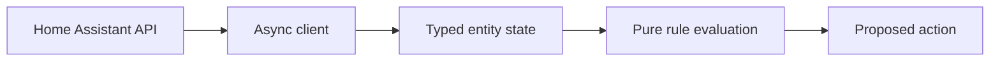

# Home Assistant Smart Home Controller

[](https://github.com/jpbutter/home-assistant-smart-home-controller/actions/workflows/ci.yml)
[](https://www.python.org/)
[](LICENSE)

A small, typed Python toolkit for building testable control logic around the
[Home Assistant REST API](https://developers.home-assistant.io/docs/api/rest/).
It keeps state retrieval, decisions, and service execution separate so rules can
be tested without a live home or real devices.

> **Project status:** v0.1.0 release candidate. The API is intentionally small
> and may evolve before a stable release.

## Why this exists

Home Assistant automations are excellent for local event-driven behavior. Some
integrations nevertheless benefit from an external Python process: prototyping
energy policies, evaluating reusable rules, generating explainable proposed
actions, or connecting a separate operational service to Home Assistant.

This project provides the narrow foundation for those cases:

- an asynchronous REST client for health checks, entity states, and services;
- typed conversion of Home Assistant state payloads;
- a pure threshold rule that returns a proposed action without executing it;
- a CLI for connectivity checks and state inspection;
- synthetic configuration examples and tests that need no Home Assistant server.

It does **not** provide a scheduler, a YAML rule loader, a WebSocket client, a
hosted service, or safety-certified control. The files in `config/` illustrate
future configuration shapes; v0.1.0 does not load them.

## Requirements

- Python 3.11 or newer
- A reachable Home Assistant instance
- A Home Assistant long-lived access token for live CLI/API use

## Installation

The package is currently installed from source; no PyPI publication is claimed.

```bash
git clone https://github.com/jpbutter/home-assistant-smart-home-controller.git
cd home-assistant-smart-home-controller
python -m venv .venv
source .venv/bin/activate
python -m pip install -e .
```

For development tools:

```bash
python -m pip install -e ".[dev]"
```

On Windows PowerShell, activate the environment with
`.venv\Scripts\Activate.ps1`.

## Configuration

Create environment variables locally. Never commit the token.

```bash
export HOME_ASSISTANT_URL="http://homeassistant.local:8123"
export HOME_ASSISTANT_TOKEN="replace-with-your-local-token"
```

The checked-in `.env.example` contains placeholders only. The CLI reads the
environment directly and does not automatically load `.env` files.

## Usage

Verify authentication and API reachability:

```bash
ha-controller check
```

Read one entity:

```bash
ha-controller state sensor.living_room_temperature
```

Use the client and decision model from Python:

```python
import asyncio
import os

from ha_controller.client import HomeAssistantClient
from ha_controller.rules import ThresholdRule


async def main() -> None:
    async with HomeAssistantClient(
        os.environ["HOME_ASSISTANT_URL"],
        os.environ["HOME_ASSISTANT_TOKEN"],
    ) as client:
        state = await client.get_state("sensor.workshop_temperature")
        rule = ThresholdRule(
            source_entity="sensor.workshop_temperature",
            above=28.0,
            target_entity="fan.workshop",
            service="fan.turn_on",
        )
        action = rule.evaluate(state)
        if action is not None:
            # Review, logging, cooldowns, and approval belong outside the rule.
            print(action)


asyncio.run(main())
```

The example deliberately prints the proposal instead of switching a device.
Calling `client.call_service(...)` is an explicit, separate action.

## Architecture



The REST client owns authentication, transport, response validation, and closing
connections. Models define the boundary between remote JSON and local code. Rules
are pure and never perform network calls. A future executor may apply proposals
only after logging, cooldown, idempotency, and policy checks.

See [Architecture](docs/architecture.md) and [Operations](docs/operations.md) for
the detailed boundaries.

## Security model

- Tokens are supplied through environment variables and never included in logs.
- HTTP and response-shape failures are explicit errors, not false sensor values.
- Tests use `httpx.MockTransport` and synthetic entity identifiers.
- Rule evaluation produces proposals; it does not silently execute them.
- This software must not be the sole control for alarms, locks, heating limits,
  overcurrent protection, water protection, or other safety-critical functions.
- Device-local safeguards and certified protective hardware remain authoritative.

Please read [SECURITY.md](SECURITY.md) before reporting a vulnerability.

## Development

```bash
ruff check .
ruff format --check .
mypy src
pytest
python -m build
twine check dist/*
```

CI runs linting and type checks, tests Python 3.11 through 3.14, and validates the
source distribution and wheel. Contribution expectations are documented in
[CONTRIBUTING.md](CONTRIBUTING.md).

## Roadmap

Near-term work focuses on safer execution controls, live-state subscriptions,
and energy-orchestration examples. Scope and non-goals are maintained in
[ROADMAP.md](ROADMAP.md). Roadmap items are intentions, not release promises.

## Maintainers and support

See [MAINTAINERS.md](MAINTAINERS.md) for governance and release ownership and
[SUPPORT.md](SUPPORT.md) for where to ask questions. Release instructions and the
prepared v0.1.0 notes live under `docs/`.

## License and attribution

Licensed under the [MIT License](LICENSE).

This is an independent open-source project. Home Assistant is a trademark of the
Open Home Foundation. This repository is not affiliated with or endorsed by the
Home Assistant project or the Open Home Foundation.
